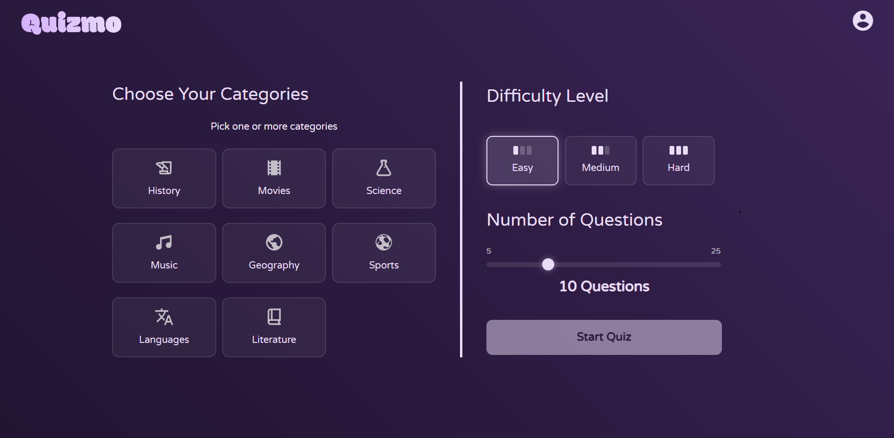
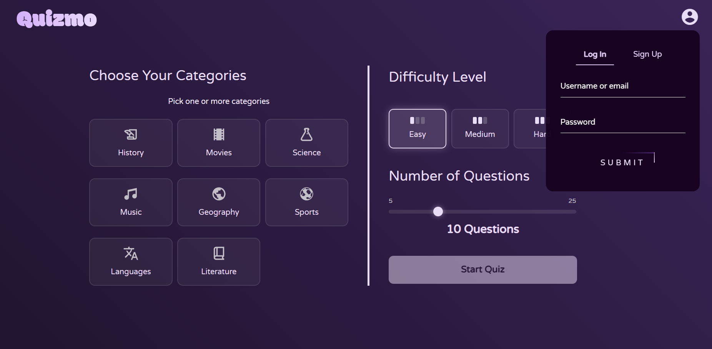
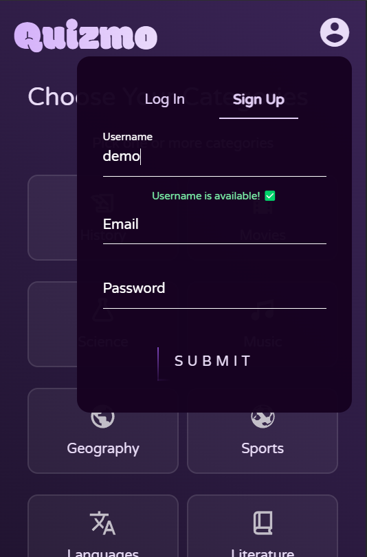
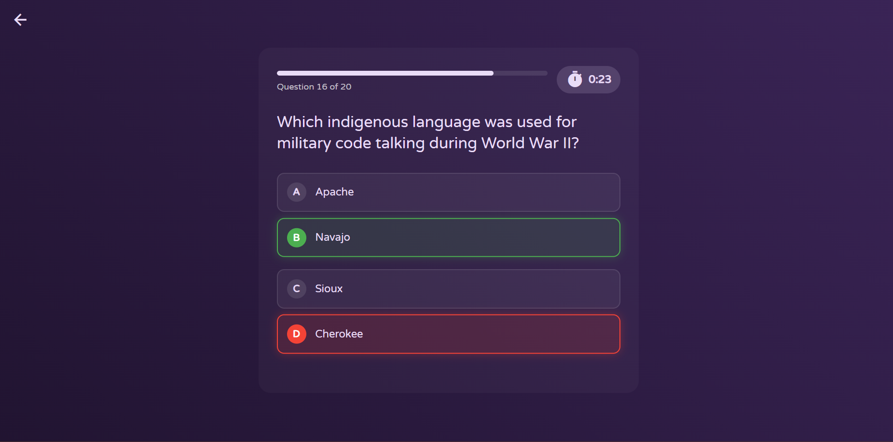
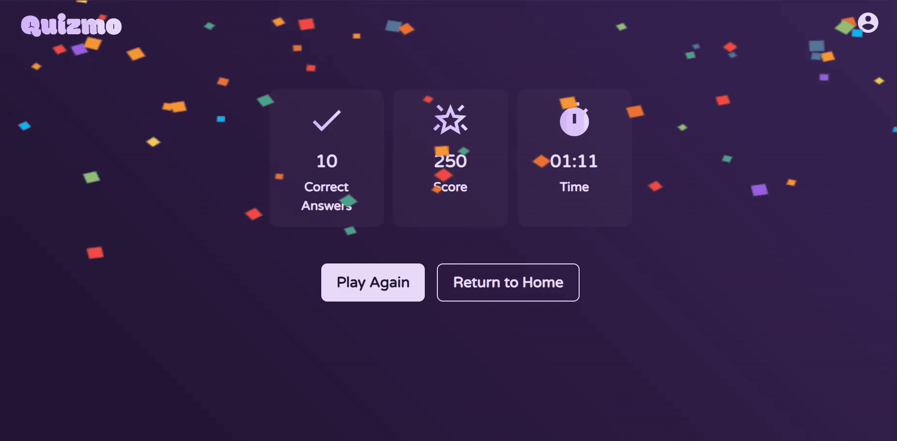

# QuizApp

A containerized web quiz application that allows users to participate in timed quizzes to test their knowledge. Built with Java (Spring Boot), Angular, PostgreSQL, and Docker.



## Tech Stack

- Java 17 / Spring Boot
- Maven
- Angular v19
- PostgreSQL
- Docker & Docker Compose

### Features
- responsive design
- token-based authentication
- microservice architecture
- containerized
- automatic database cleanup

### Gallery






## Getting Started

Follow the steps below to run the application locally using Docker.

### 1. Clone the Repository

```bash
git clone https://github.com/daria-balaj/QuizApp.git
cd quizapp
```

### 2. Create and run the docker containers
```bash
docker-compose up --build
```
This will:
- build and start all the required containers
- create a local Docker volume to store the database data persistently across container restarts
- initialize and populate the database with sample data

### 3. Done!
The app will be available at http://localhost:4200